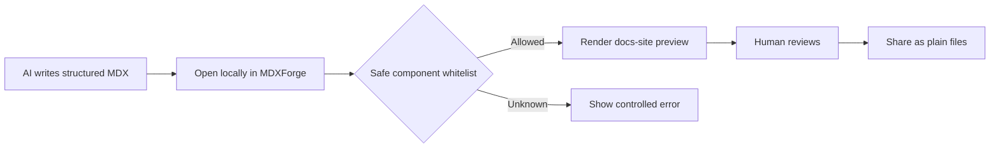
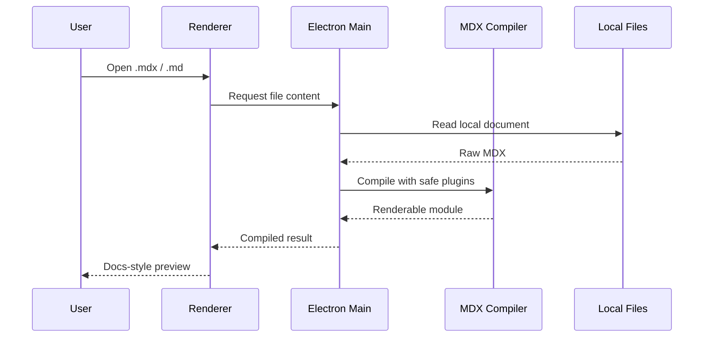
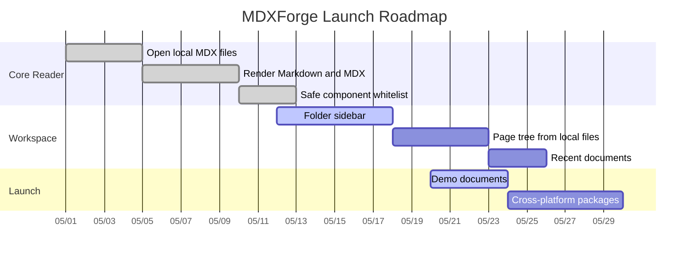
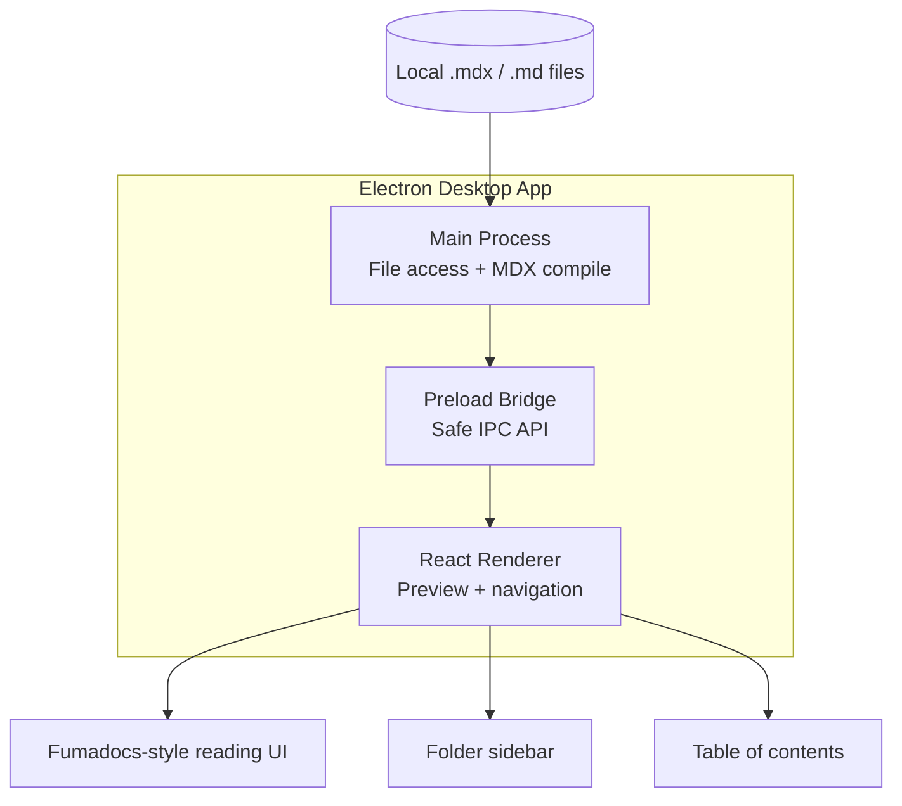
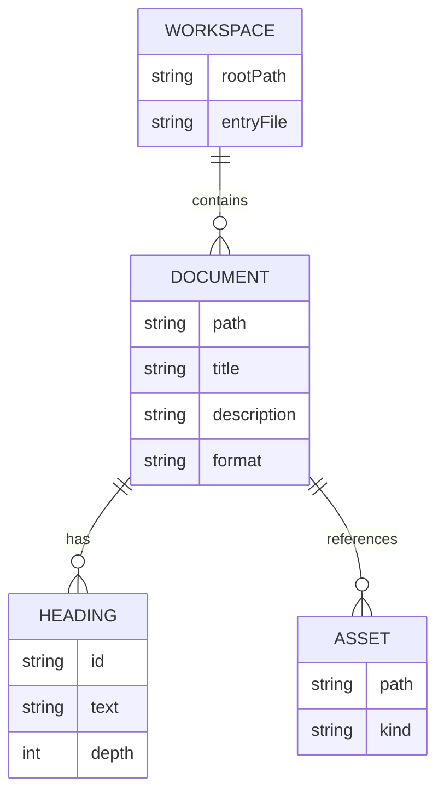
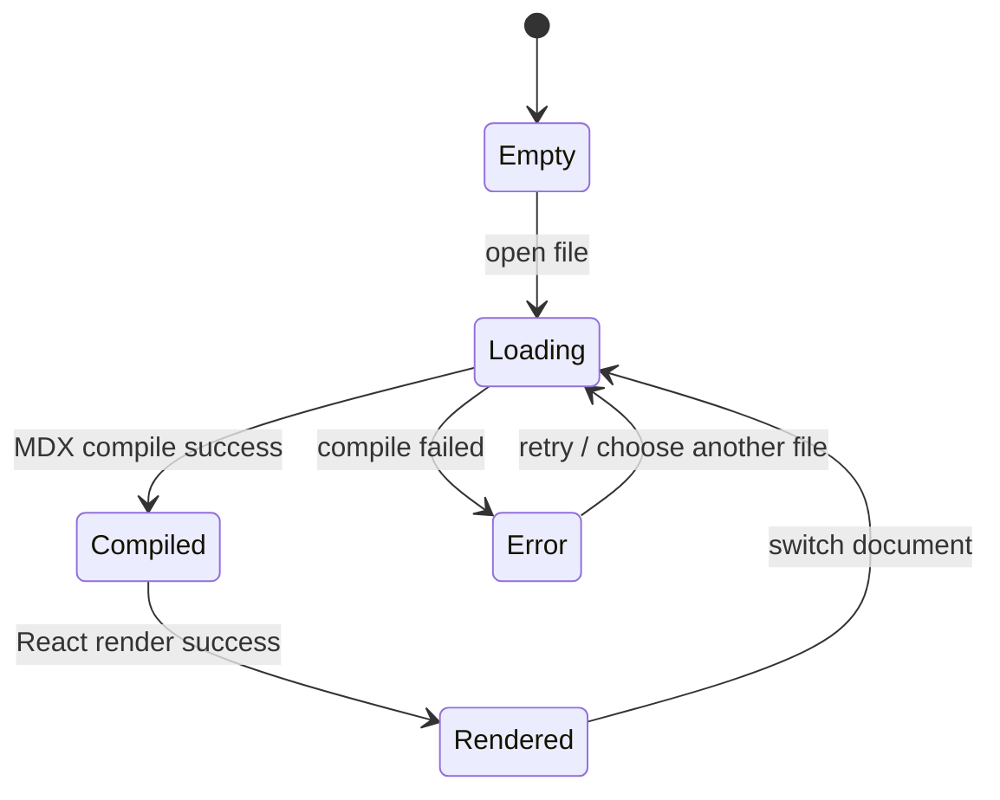
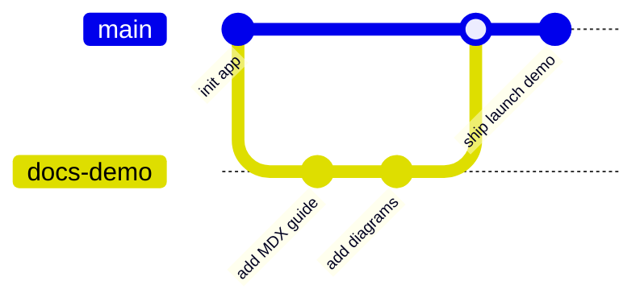
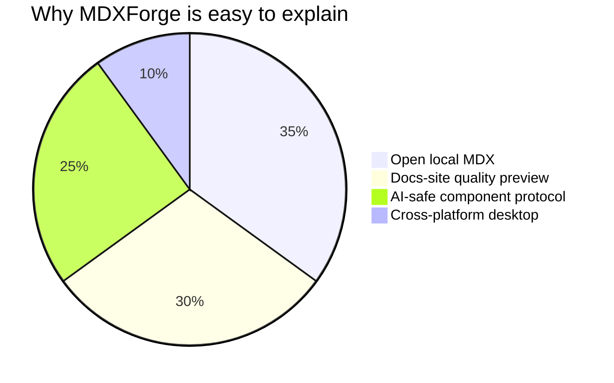

---
title: MDXForge Launch Demo
description: A cinematic MDX document that shows why AI-native docs need more than Markdown.
---

# MDXForge Launch Demo

<Banner variant="normal" changeLayout={false}>
  Open MDX like Markdown. Render it like a production docs site. Keep AI output controlled.
</Banner>

<Callout type="success" title="What this file proves">
  A single local `.mdx` file can behave like a polished documentation page: structured, readable, component-rich, and still easy for AI to generate.
</Callout>

## The Moment

AI can already write long documents. The bottleneck is no longer generation. The bottleneck is **format**.

Plain Markdown is readable, but it flattens product specs, API guides, architecture notes, release plans, and onboarding flows into the same few primitives. HTML is expressive, but too noisy for humans and too expensive for AI context windows.

MDXForge turns MDX into a local document surface: expressive enough for real product knowledge, constrained enough for predictable rendering.

<Cards>
  <Card title="Markdown-simple" description="Files stay editable, portable, and readable in plain text." />
  <Card title="Docs-site rich" description="Callouts, tabs, steps, todos, file trees, API tables, images, and code blocks render locally." />
  <Card title="AI-controlled" description="A component whitelist gives AI a safe protocol instead of arbitrary JSX." />
</Cards>

## Before and After

<Tabs items={["Markdown", "HTML", "MDX"]}>
  <Tab>

```md
> Warning: rotate the key before production.

### Step 1
Create an environment file.

### Step 2
Add the token.

### Step 3
Restart the service.
```

Markdown is clean, but it loses structure. A reader sees paragraphs. AI sees weak semantics.

  </Tab>
  <Tab>

```html
<div class="callout warning">
  <strong>Warning</strong>
  <p>Rotate the key before production.</p>
</div>
<div class="steps">
  <div class="step">Create an environment file.</div>
  <div class="step">Add the token.</div>
  <div class="step">Restart the service.</div>
</div>
```

HTML can express the UI, but it burns tokens on layout instead of knowledge.

  </Tab>
  <Tab>

```mdx
<Callout type="warn" title="Production key">
  Rotate the key before production.
</Callout>

<Steps>
  <Step>Create an environment file.</Step>
  <Step>Add the token.</Step>
  <Step>Restart the service.</Step>
</Steps>
```

MDX keeps the authoring surface small while preserving intent.

  </Tab>
</Tabs>

## A Real AI-Written Operating Guide

<Callout type="info" title="Scenario">
  Imagine an AI agent just finished implementing a billing webhook. Instead of sending a wall of Markdown, it writes this structured handoff directly into `docs/billing-webhooks.mdx`.
</Callout>

<Steps>
  <Step>
    **Create the webhook endpoint** in the API service and keep request verification before JSON parsing.
  </Step>
  <Step>
    **Store raw events** before mutating account state, so replay and audit paths remain available.
  </Step>
  <Step>
    **Map provider events** to internal subscription transitions with an explicit state table.
  </Step>
  <Step>
    **Preview the handoff locally** in MDXForge before opening a pull request.
  </Step>
</Steps>

<TodoList title="Handoff checklist" description="Static task state for the reader, not an editable project tracker.">
  <Todo checked>Endpoint implementation committed.</Todo>
  <Todo status="active">Preview the handoff in MDXForge.</Todo>
  <Todo status="blocked">Wait for staging webhook secrets.</Todo>
  <Todo>Attach final rollout notes.</Todo>
</TodoList>

<Files>
  <Folder name="docs" defaultOpen>
    <File name="billing-webhooks.mdx" />
    <File name="release-checklist.mdx" />
    <Folder name="runbooks" defaultOpen>
      <File name="incident-response.mdx" />
      <File name="key-rotation.mdx" />
    </Folder>
  </Folder>
  <Folder name="src" defaultOpen>
    <Folder name="api" defaultOpen>
      <File name="billing-webhook.ts" />
      <File name="verify-signature.ts" />
    </Folder>
  </Folder>
  <File name="package.json" />
</Files>

## Implementation Contract

<TypeTable
  type={{
    source: {
      type: 'string',
      description: 'Absolute local file path opened by MDXForge.',
      required: true
    },
    components: {
      type: 'Record<string, React.ComponentType>',
      description: 'Allowed MDX component map available to the document.',
      required: true
    },
    frontmatter: {
      type: 'Record<string, unknown>',
      description: 'Document metadata parsed from YAML frontmatter.',
      default: '{}'
    },
    unsafeJs: {
      type: 'never',
      description: 'Runtime JavaScript in AI-authored MDX should be rejected by policy.'
    }
  }}
/>

## Install Flow

<Tabs items={["pnpm", "npm", "CLI"]}>
  <Tab>

```bash
pnpm install
pnpm dev
```

  </Tab>
  <Tab>

```bash
npm install
npm run dev
```

  </Tab>
  <Tab>

```bash
df ./docs/billing-webhooks.mdx
mdxforge ./docs
```

  </Tab>
</Tabs>

## Renderer Core

<DynamicCodeBlock
  lang="tsx"
  code={'const compiled = await compile(file.content, {\n  outputFormat: "function-body",\n  remarkPlugins: [[remarkHeading, { generateToc: false }]],\n  rehypePlugins: [rehypeCode, rehypeToc],\n})\n\nconst module = new Function(String(compiled))(runtime)\nconst Page = module.default\n\nreturn <Page components={getMDXComponents()} />'}
  codeblock={{ title: 'MdxPreview.tsx' }}
/>

<Accordions>
  <Accordion title="Why not just use a docs site?">
    A docs site is great for publishing. MDXForge is for local reading, AI handoff, drafts, design notes, architecture reviews, and documents that should not require a full web app to preview.
  </Accordion>
  <Accordion title="Why not just use Markdown preview?">
    Markdown preview loses the components that make modern docs useful: tabs, callouts, file trees, API tables, steps, banners, and rich code blocks.
  </Accordion>
  <Accordion title="Why does AI benefit from MDX?">
    MDX gives AI named structures. A `Step`, `Callout`, or `TypeTable` carries more intent than a heading convention or a pile of HTML nodes.
  </Accordion>
</Accordions>

## Visual Proof

<Callout type="info" title="Diagram-ready docs">
  MDXForge renders Mermaid directly from fenced code blocks, so AI can ship architecture diagrams, flowcharts, Gantt plans, and engineering visuals in the same local `.mdx` file.
</Callout>

### Flowchart: from AI output to reviewed document



### Sequence: local MDX rendering pipeline



### Gantt: product roadmap in one document



### Architecture: app responsibilities



### ER diagram: document model



### State diagram: preview lifecycle



### Git graph: docs evolve with code



### Pie chart: launch-message focus



<ImageZoom src="https://placehold.co/1280x720/111827/ffffff/png?text=MDXForge+MDX+Workspace" alt="MDXForge MDX workspace preview" width={1280} height={720} />

<Heading as="h2" id="launch-positioning">
  Launch Positioning
</Heading>

<InlineTOC
  items={[
    { title: 'The Moment', url: '#the-moment', depth: 2 },
    { title: 'Before and After', url: '#before-and-after', depth: 2 },
    { title: 'Implementation Contract', url: '#implementation-contract', depth: 2 },
    { title: 'Launch Positioning', url: '#launch-positioning', depth: 2 }
  ]}
>
  Demo outline
</InlineTOC>

> Open local MDX files without running a docs site. Built for AI-generated documentation with a controlled component set.

```txt
AI writes MDX -> MDXForge opens it -> humans read a real docs page -> teams keep the source as plain files
```

<Callout type="success" title="The pitch">
  Markdown is the note format. HTML is the render format. MDX is the collaboration format for humans, AI, and local docs tools.
</Callout>
